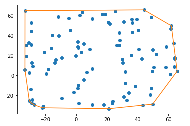

# Convex Hull for 2D points


## File Overview
* Demo.ipynb: A jupyter notebook containing Demo and some test cases
* Demo.pdf: A pdf version of Demo.ipynb
* ConvexHull.py: The body of computing comvex hull for given data

## Citation
* [Wikipedia of Quickhull](<https://en.wikipedia.org/wiki/Quickhull>)

## Sample Usage

#### Input data format
Please use 2D numpy arrays as the input. Input data should have dimensions of Nx2, where N is the number of data size. For example:

    import numpy as np

    N=100
    input_data = np.random.random((N, 2))

#### Initialization

    from ConvexHull import ConvexHull2D
    model = ConvexHull2D()

#### Compute convex hull
The output/computing result is a 2D numpy array with shape of Mx2, where M is the number of points that will form the convex hull.

    convex_hull = model(points)

#### Visualize the result
    #By adding the head to the tail, we close the polygon during plotting
    convex_hull = np.vstack([convex_hull, convex_hull[0]])
    plt.plot(convex_hull[:,0], convex_hull[:,1])
    plt.show()


#### Check if some points are inside the convex hull
Given a test dataset with shape of Nx2, we will check if these points are inside the convex hull computed by the data above. Notice that you need to first run the model to compute the hull then run this test, otherwise the function will yield exceptions.

The output, isInside, is a 1D numpy array with binary value, True or False, indicating whether the corresponding point is inside the convex hull.

    points = np.random.random((100,2)) * 100
    test_points = np.random.random((10,2)) * 100
    convex_hull = model(points)
    isInside = model.isInside(test_points)


## Algorithm Overview: Quickhull Algorithm

### General Steps

1. Find the points with minimum and maximum x coordinates, as these will always be part of the convex hull.

2. Use the line formed by the two points to divide the set in two subsets of points, which will be processed recursively.

3. Determine the point, on one side of the line, with the maximum distance from the line. This point forms a triangle with those of the line.

4. The points lying inside of that triangle cannot be part of the convex hull and can therefore be ignored in the next steps.

5. Repeat the previous two steps on the two lines formed by the triangle (not the initial line).

6. Keep on doing so on until no more points are left, the recursion has come to an end and the points selected constitute the convex hull.


### Pseudocode for 2D set of points

```pseudocode
Input = a set S of n points
Assume that there are at least 2 points in the input set S of points

QuickHull (S)
{
    // Find convex hull from the set S of n points
    Convex Hull := {}
    Find left and right most points, say A & B, and add A & B to convex hull
    Segment AB divides the remaining (n-2) points into 2 groups S1 and S2
        where S1 are points in S that are on the right side of the oriented line from A to B,
        and S2 are points in S that are on the right side of the oriented line from B to A
    FindHull (S1, A, B)
    FindHull (S2, B, A)
}

FindHull (Sk, P, Q)
{
    // Find points on convex hull from the set Sk of points
    // that are on the right side of the oriented line from P to Q
    If Sk has no point, then return.
    From the given set of points in Sk, find farthest point, say C, from segment PQ
    Add point C to convex hull at the location between P and Q
    Three points P, Q, and C partition the remaining points of Sk into 3 subsets: S0, S1, and S2
        where S0 are points inside triangle PCQ, S1 are points on the right side of the oriented
        line from  P to C, and S2 are points on the right side of the oriented line from C to Q.
    FindHull (S1, P, C)
    FindHull (S2, C, Q)
}

Output = Convex Hull
```
